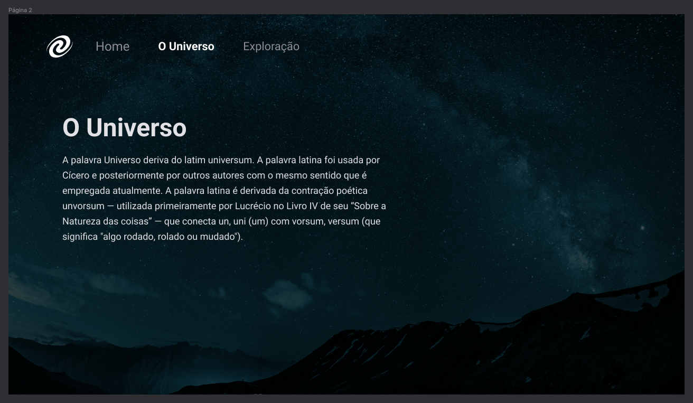

# SPA Universe (https://emojipedia.org/comet)

## Sobre o Projeto 💻

O **SPA Universe** é uma aplicação desenvolvida com o objetivo de explorar conceitos fundamentais de Single Page Applications (SPA).

  

### Link para o Layout 🎨

Link do layout do projeto no Figma:
[SPA Universe - Figma](https://www.figma.com/design/mK0DIkDa7FHxh0OQ5kefjh/%5BDesafios-Explorer%5D-SPA-Universe-(Copy)?node-id=104-48&p=f&t=esTbzJGl5O3MsQtQ-0) 🔗

## O que será abordado no projeto 📖

- **Conceitos de SPA (Single Page Application):** Criação de aplicações que não recarregam a página inteira.
- **Mapeamento de Rotas:** Implementação de navegação entre diferentes "páginas" da aplicação, sem a necessidade de recarregar o navegador.
- **Assíncrono e Promises:** Requisições assíncronas para tornar a aplicação responsiva.
- **Orientação a Objetos e Classes:** Aplicação de princípios de POO para criar código organizado e reutilizável.

## Tecnologias Utilizadas (https://emojipedia.org/check-mark)

- HTML5
- CSS3
- JavaScript

## Plataforma de Ensino 🚀

Projeto que faz parte da trilha de aprendizado da [Rocketseat](https://www.rocketseat.com.br) 🔗

---

Desenvolvido por William Milanez.